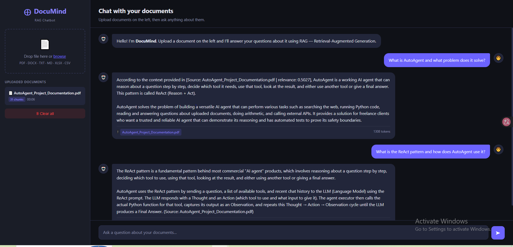

# 🧠 DocuMind — RAG Chatbot

Upload any **PDF, DOCX, TXT, MD, XLSX, or CSV** file and chat with it using Retrieval-Augmented Generation powered by **Groq LLaMA** and **ChromaDB**.

[](https://python.org)
[](https://flask.palletsprojects.com/)
[](https://groq.com/)
[](https://www.trychroma.com/)
[](https://opensource.org/licenses/MIT)

---

## 📸 Interface



---

## ✨ Features

| Feature | Description |
|---|---|
| 📄 Multi-Format Support | PDF, DOCX, TXT, MD, XLSX, CSV |
| 🔍 Semantic Search | Vector search via ChromaDB + sentence-transformers |
| 🧠 RAG Pipeline | Retrieval-Augmented Generation with source citations |
| 💬 Interactive Chat | Real-time conversation with your documents |
| 🎯 Source Citations | See exactly where each answer comes from |
| 📊 Token Tracking | Daily usage monitoring with budget warnings |
| 🔐 API Security | Key-based authentication on all endpoints |
| 📱 Responsive UI | Clean dark-themed interface with drag-and-drop upload |

---

## 🚀 Quick Start

**Windows**
````bat
setup.bat
venv\Scripts\activate
python app.py
````

**Linux / macOS**
````bash
chmod +x setup.sh
./setup.sh
source venv/bin/activate
python app.py
````

Then open **http://localhost:5000** 🎉

---

## 📦 Installation

**1. Clone the repo**
````bash
git clone https://github.com/Tayyabah-Rehman/DocuMind.git
cd DocuMind
````

**2. Configure environment**
````bash
cp .env.example .env
# Edit .env and add your keys
````

**3. Run setup & start**
````bash
# Windows
setup.bat

# Linux/macOS
chmod +x setup.sh && ./setup.sh

python app.py
````

---

## 📁 Project Structure

````
DocuMind/
├── app.py                     ← Flask app (all routes)
├── config.py                  ← Typed settings loaded from .env
├── requirements.txt
├── .env                       ← Your secrets (never commit this)
├── .env.example               ← Template
├── setup.bat                  ← Windows one-click setup
├── setup.sh                   ← Linux/macOS one-click setup
│
├── utils/
│   ├── __init__.py            ← Exports all public functions
│   ├── security.py            ← File validation, path safety, API key check
│   ├── document_processor.py  ← Text extraction + chunking
│   ├── rag_engine.py          ← ChromaDB embed / store / retrieve
│   └── token_manager.py       ← Daily token usage tracking
│
├── templates/
│   └── index.html
│
└── static/
    ├── css/style.css
    └── js/app.js
````

---

## 🌍 Supported File Types

| Format | How It's Processed |
|---|---|
| PDF | Text extraction via PyPDF2 |
| DOCX | Paragraph extraction via python-docx |
| TXT / MD | Plain text, read directly |
| XLSX | All sheets via openpyxl |
| CSV | Rows read as structured text |

Any filename is accepted — no naming restrictions.

---

## 🔐 Environment Variables

| Variable | Description | Default |
|---|---|---|
| `GROQ_API_KEY` | Your Groq API key | Required |
| `GROQ_MODEL` | LLM model to use | `llama-3.3-70b-versatile` |
| `SECRET_KEY` | Flask session secret | Required |
| `API_KEYS` | Comma-separated API keys | Required |
| `DAILY_TOKEN_BUDGET` | Max tokens per day | `100000` |
| `TOKEN_WARN_THRESHOLD` | Warning threshold | `70000` |
| `SKIP_CONFIG_VALIDATION` | Set `true` in development | `false` |
| `CHROMA_PERSIST_DIR` | Vector DB path | `./vectorstore` |
| `UPLOAD_FOLDER` | Upload directory | `./uploads` |

---

## 🛠️ Tech Stack

| Layer | Technology |
|---|---|
| Backend | Flask (Python) |
| LLM | Groq LLaMA 3.3 70B |
| Vector DB | ChromaDB |
| Embeddings | sentence-transformers (`paraphrase-MiniLM-L3-v2`) |
| Document Parsing | LangChain, PyPDF2, python-docx, pandas, openpyxl |
| Frontend | HTML5, CSS3, Vanilla JS |

---

## 🔑 Key Design Decisions

- **Model loaded once at startup** — the embedding model is pre-downloaded by the setup script, not on every upload.
- **Groq key stays server-side** — the frontend never sees your API key.
- **ChromaDB collection naming** — always `doc_` + 12-char MD5 hash, safely within ChromaDB's 3–63 character limit.
- **Duplicate detection** — re-uploading the same file skips re-embedding automatically.
- **Server-side sessions** — Flask-Session writes to disk so large document lists never overflow the cookie.

---

## 🤝 Contributing

1. Fork the repository
2. Create a feature branch: `git checkout -b feature/my-feature`
3. Commit your changes: `git commit -m 'Add my feature'`
4. Push: `git push origin feature/my-feature`
5. Open a Pull Request

---

## 📄 License

Distributed under the **MIT License**. See `LICENSE` for more information.

---

## 🙏 Acknowledgments

- [Groq](https://groq.com/) — lightning-fast LLaMA inference
- [LangChain](https://langchain.com/) — RAG framework
- [ChromaDB](https://www.trychroma.com/) — vector storage
- [Sentence-Transformers](https://www.sbert.net/) — embeddings

---

<div align="center">
⭐ If DocuMind helped you, give it a star on GitHub!
</div>
